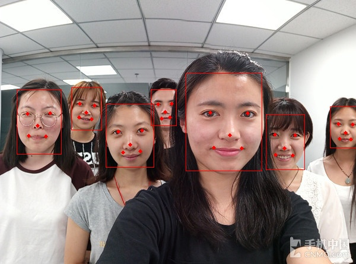

## 使用说明

运行window.py，显示GUI

整个系统使用window.py中的window类和face_recogniton.py中的face_recogniton类。

其中face_recogniton是整合了face_detection.py，affineTrans.py，featureExtraction.py；

因此你可以通过这几个文件了解流程。

```
# 流程
# 人脸检测-》人脸对齐-》特征向量提取-》相似度对比
# 利用face_detection提取人脸，获取特征点，在affineTrans进行仿射变换对齐为112*112图片
# 接着在featureExtraction中提取特征向量，最后进行相似度对比。
```

### 注意

如果cudn内存不够或者系统没有GPU，请**取消注释**face_recognition中的一下代码

```python
# 取消注释表示设置利用cpu
# import os
#
# os.environ["CUDA_DEVICE_ORDER"] = "PCI_BUS_ID"
# os.environ["CUDA_VISIBLE_DEVICES"] = "-1"
```

### 运行环境

python1.6.0+tensorflow 1.12.0

## 函数说明

### face_detection.py

```python
# 获取5个特征点和人脸检测框
def get_landmarkAndrect(image_path='./images/0001.png')
```

返回人脸5个特征点数组列表和对应人脸检测框列表。

可以直接运行本文件得到如下结果



### affineTrans.py

```python
def get_cropImage(face_landmarks, img_path="images/face_test.jpg", mode=1)
```

返回仿射变换后的对齐图像(mode=1表示112\*112，mode=2表示112\*96)

可以直接运行本文件得到如下结果


### featureExtraction.py

```python
# 获取112*112图片的特征向量
def get_512features(img_path='images/112_112.jpg'):
```

返回对齐图像的特征向量值

可以直接运行本文得到如下结果

```
-7.06420047e-03 -4.02247421e-02  5.08635081e-02 -4.72537568e-03
7.56369787e-04 -4.51981463e-03  1.13019533e-02 -5.53472899e-02
-4.00648527e-02 -4.12669219e-02 -2.16021296e-02  1.97736938e-02
-1.26779191e-02  1.98411848e-02 -7.07795396e-02  6.14322238e-02
-3.71924862e-02  5.16385324e-02 -6.80582300e-02  4.65788767e-02
...
```

